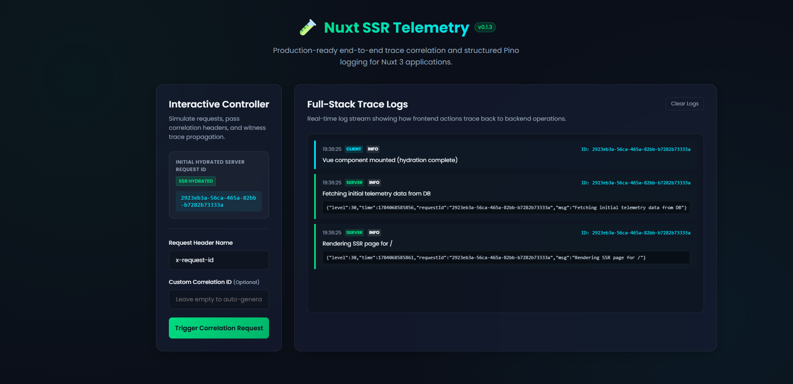
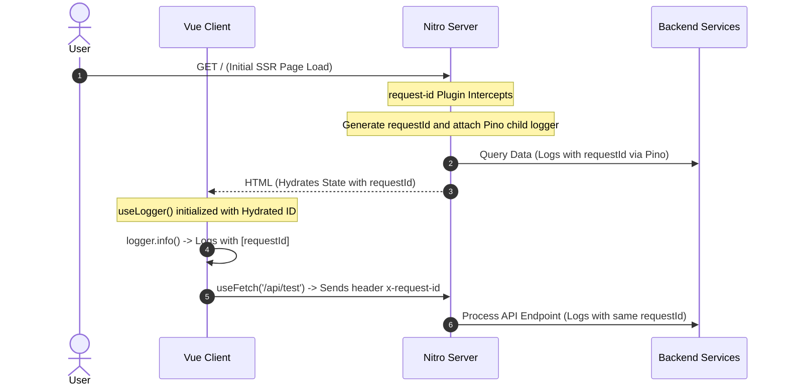

# Nuxt SSR Telemetry

[![npm version][npm-version-src]][npm-version-href]
[![npm downloads][npm-downloads-src]][npm-downloads-href]
[![License][license-src]][license-href]
[![Nuxt][nuxt-src]][nuxt-href]
[![Build Status][ci-src]][ci-href]

🎮 **[Live Demo / Playground](https://nuxt-ssr-telemetry-playground.vercel.app/)**

`nuxt-ssr-telemetry` is a production-ready telemetry module for Nuxt 3 that solves the complex problem of **Log Traceability (Correlation)** across Server-Side Rendering (SSR) and Client-Side rendering (CSR) boundaries.

It integrates **Pino** (a zero-overhead Node.js logging engine) into the Nitro backend and correlates client-side page rendering and browser API requests with backend database/external API call logs using a unique, consistent `request-id` trace.

<p align="center">
  
</p>

---

## ⛰️ The Problem: Lost Traces in SSR Applications

In microservice or cloud-native architectures, tracing errors is critical. In typical SSR applications:
1. A user clicks a button and triggers a client-side fetch.
2. The server processes this request and logs database operations.
3. If an error occurs, searching millions of logs across the stack is incredibly painful because the client context and server-side logs are decoupled.

## 🚠 The Solution: End-to-End Log Correlation

`nuxt-ssr-telemetry` automatically bridges this gap:
- **Server Interceptor**: Captures the `x-request-id` request header (or generates a new unique UUID) on every Nitro request.
- **Contextual Pino Logging**: Automatically spawns a fast Pino child logger matching that specific `requestId`, making it available throughout the backend call stack.
- **Hydration Bridge**: Transfers the unique ID from server to client during SSR hydration.
- **Client Wrapper**: Provides an elegant `useLogger()` composable on the frontend that automatically prefixes all browser console logs with the `requestId`.

---

## ✨ Features

- 🚀 **High Performance**: Powered by Pino, the fastest JSON logger for Node.js.
- 🔗 **Full-Stack Traceability**: Links Vue client actions, SSR rendering logs, and Nitro API handler logs via a single request ID.
- 🛠️ **Developer Experience (DX)**: Zero-config setup with full TypeScript definitions for auto-completion (extends `H3EventContext` and Nuxt's internal app types).
- 💧 **Seamless Hydration**: Safely extracts the request ID on the server and propagates it to the client side.

---

## 🚀 Quick Setup

Install the dependency in your Nuxt project:

```bash
# Add module
npx nuxt module add nuxt-ssr-telemetry
```

Add it to your `nuxt.config.ts` configuration:

```typescript
export default defineNuxtConfig({
  modules: [
    'nuxt-ssr-telemetry'
  ]
})
```

### ⚙️ Configuration

You can customize the module behavior by adding a `telemetry` configuration block:

```typescript
export default defineNuxtConfig({
  modules: [
    'nuxt-ssr-telemetry'
  ],
  
  // Optional configuration options
  telemetry: {
    // Enable or disable logging and request-id injection globally
    enabled: true,
    
    // The HTTP header name used to extract/set the Request ID.
    // Change this if you are using custom API Gateways, AWS ALBs (e.g. x-amzn-trace-id), or Cloudflare.
    requestIdHeader: 'x-request-id'
  }
})
```

---

## 📖 Usage

### 1. Server-Side Logging (Nitro API Routes)

Every endpoint receives a contextual Pino logger instance pre-configured with the current request's ID on `event.context.logger`.

```typescript
// server/api/users.ts
import { defineEventHandler } from 'h3'

export default defineEventHandler((event) => {
  // Logs: {"level":30,"time":169999999,"requestId":"abc-123-uuid","msg":"Fetching user details"}
  event.context.logger.info('Fetching user details')

  // Access the current request ID directly
  const requestId = event.context.requestId

  return { 
    success: true, 
    requestId 
  }
})
```

### 2. Client-Side Logging (Vue Components)

Import the auto-imported `useLogger` composable inside your Vue components. The logger will automatically prefix browser console logs with the correct request ID (matching the SSR request during initial load or Hydration).

```vue
<!-- app.vue -->
<script setup lang="ts">
const logger = useLogger()

onMounted(() => {
  // Logs: "[abc-123-uuid] Vue component mounted"
  logger.info('Vue component mounted')
})

const triggerAction = async () => {
  logger.warn('User triggered a transaction')
  const { data } = await useFetch('/api/test')
}
</script>
```

---

## ⚙️ How It Works (Under the Hood)

### End-to-End Lifecycle:



1. **Nitro Request Hook**: The server plugin hooks into `request`, generates/parses the ID, and mounts `event.context.logger` and `event.context.requestId`.
2. **Type Extensions**: The module leverages TypeScript's declaration merging to cleanly extend H3's types:
   ```typescript
   declare module 'h3' {
     interface H3EventContext {
       requestId: string
       logger: any
     }
   }
   ```
3. **Hydration Bridge**: The client-side Nuxt plugin runs `useRequestHeaders` on SSR to extract the ID, then stores it in Nuxt's reactive `useState` to make it accessible to the client app without losing correlation.

---

## 🛠️ Contribution & Local Development

### Prerequisites
- Node.js >= 18
- npm or pnpm

### Setup
```bash
# Clone the repository and install dependencies
npm install

# Generate stub types for the development playground
npm run dev:prepare

# Start the playground dev server (starts on http://localhost:3000)
npm run dev
```

### Verification & Testing
```bash
# Run strict TypeScript type verification
npm run test:types

# Run ESLint validation
npm run lint

# Run Vitest test suites
npm run test
```

---

## License

[MIT License](./LICENSE)

<!-- Badges -->
[npm-version-src]: https://img.shields.io/npm/v/nuxt-ssr-telemetry/latest.svg?style=flat&colorA=020420&colorB=00DC82
[npm-version-href]: https://www.npmjs.com/package/nuxt-ssr-telemetry

[npm-downloads-src]: https://img.shields.io/npm/dm/nuxt-ssr-telemetry.svg?style=flat&colorA=020420&colorB=00DC82
[npm-downloads-href]: https://npm.chart.dev/nuxt-ssr-telemetry

[license-src]: https://img.shields.io/badge/License-MIT-00DC82?style=flat&colorA=020420
[license-href]: https://github.com/jeanevertonoficial/nuxt-ssr-telemetry/blob/master/LICENSE

[nuxt-src]: https://img.shields.io/badge/Nuxt-020420?logo=nuxt
[nuxt-href]: https://nuxt.com

[ci-src]: https://github.com/jeanevertonoficial/nuxt-ssr-telemetry/actions/workflows/ci.yml/badge.svg?branch=master
[ci-href]: https://github.com/jeanevertonoficial/nuxt-ssr-telemetry/actions/workflows/ci.yml
